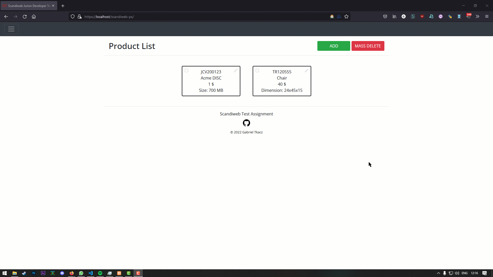
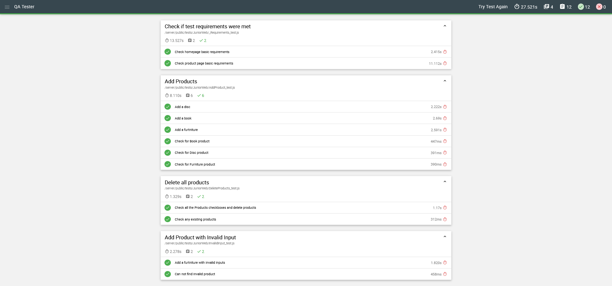

    

         
        <h1 align="center">Scandiweb Junior Developer Test Task</h1>
        <h4 align="center">Available at: <a href="scandiweb-test-assignment.rf.gd/">scandiweb-test-assignment.rf.gd/</a></h4>
    

    <h2 align="center">Built with:</h2>
    

        <ul align="center">
            <li align="center">PHP</li>
            <li align="center">MySQL</li>
            <li align="center">javascript</li>
            <li align="center">jQuery</li>
            <li align="center">Bootstrap</li>
            <li align="center">Isotope</li>
        </ul>
    

    <h2 align="center">Database structure:</h2>
    

    <table align="center">
        <tr>
            <th>Name</th>
            <th>Type</th>
            <th>Attributes</th>
        </tr>
        <tr>
            <td>SKU</td>
            <td>varchar(30)</td>
            <td>Unique</td>
        </tr>
        <tr>
            <td>NAME</td>
            <td>varchar(65)</td>
            <td>-</td>
        </tr>
        <tr>
            <td>PRICE</td>
            <td>decimal(10,0)</td>
            <td>-</td>
        </tr>
        <tr>
            <td>productType</td>
            <td>enum('Book', 'Furniture', 'DVD')</td>
            <td>-</td>
        </tr>
        <tr>
            <td>productAttribute</td>
            <td>varchar(12)</td>
            <td>-</td>
        </tr>
    </table>
    

    

        <h3 align="center">Demonstration</h3>
          
        <h3 align="center">AutoQA approval</h3>
        
    

    

        <small align="center">&copy; 2022 Gabriel Tkacz</small>
    

